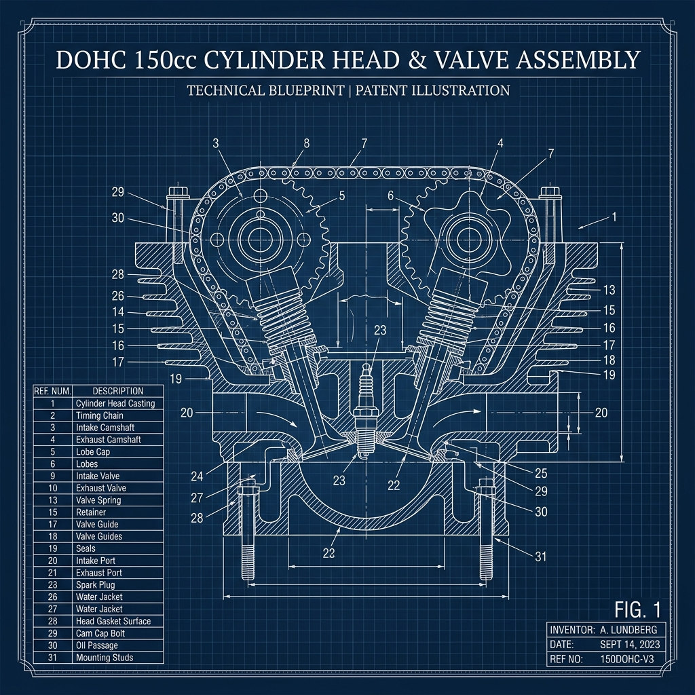

# KATALOG SUKU CADANG HONDA NEW CB150R STREETFIRE (K15G)

**Model Kendaraan:** Honda New CB150R StreetFire  
**Kode Produksi:** K15G  
**Tanggal Publikasi:** 10.07.2015  
**Bahasa:** Indonesian / English  

---

## 📋 DAFTAR ISI & KELOMPOK UTAMA

### 🛠️ KELOMPOK MESIN (ENGINE BLOCK)
| Kode Blok | Deskripsi Blok (Bahasa Indonesia) | Description (English) |
| :--- | :--- | :--- |
| **E-1** | Tutup Kepala Silinder | CYLINDER HEAD COVER |
| **E-2** | Kepala Silinder | CYLINDER HEAD |
| **E-3** | Poros Bubungan/Klep | CAMSHAFT/VALVE |
| **E-4** | Rantai Mesin/Tensioner | CAM CHAIN/TENSIONER |
| **E-5** | Silinder | CYLINDER |
| **E-6** | Tutup Bak Mesin Kanan | RIGHT CRANKCASE COVER |
| **E-8** | Kopling | CLUTCH |
| **E-9** | Kopling Starter | STARTING CLUTCH |
| **E-10** | Tutup Bak Mesin Kiri | LEFT CRANKCASE COVER |
| **E-11** | Generator | GENERATOR |
| **E-12** | Pompa Air | WATER PUMP |
| **E-13** | Motor Starter | STARTER MOTOR |
| **E-14** | Pompa Oli | OIL PUMP |
| **E-15** | Bak Mesin | CRANKCASE |
| **E-16** | Poros Engkol/Piston | CRANKSHAFT/PISTON |
| **E-17** | Transmisi | TRANSMISSION |
| **E-19** | Drum Perpindahan Gigi | GEARSHIFT DRUM |
| **E-20** | Poros Kick Starter | KICK STARTER SPINDLE |
| **E-23** | Rumah Throttle | THROTTLE BODY |

### 🏍️ KELOMPOK RANGKA (FRAME BLOCK)
| Kode Blok | Deskripsi Blok (Bahasa Indonesia) | Description (English) |
| :--- | :--- | :--- |
| **F-1** | Lampu Depan | HEADLIGHT |
| **F-2** | Meter | METER |
| **F-3** | Batang Kemudi/Top Bridge | HANDLE PIPE/TOP BRIDGE |
| **F-4** | Spion | MIRROR |
| **F-5** | Master Silinder Rem Depan | FRONT BRAKE MASTER CYLINDER |
| **F-7** | Handle Lever/Switch/Cable | HANDLE LEVER/SWITCH/CABLE |
| **F-9** | Steering Stem | STEERING STEM |
| **F-10** | Spakbor Depan | FRONT FENDER |
| **F-11** | Garpu Depan | FRONT FORK |
| **F-12-10** | Kaliper Rem Depan | FRONT BRAKE CALIPER |
| **F-14-40** | Roda Depan | FRONT WHEEL |
| **F-15** | Master Silinder Rem Belakang | REAR BRAKE MASTER CYLINDER |
| **F-17** | Kaliper Rem Belakang | REAR BRAKE CALIPER |
| **F-19-40** | Roda Belakang | REAR WHEEL |
| **F-21** | Fuel Tank | FUEL TANK |
| **F-22** | Jok / Tempat Duduk | SEAT |
| **F-23** | Side Cowl | SIDE COWL |
| **F-24** | Shroud | SHROUD |
| **F-25** | Pembersih Udara | AIR CLEANER |
| **F-27** | Knalpot | EXHAUST MUFFLER |
| **F-29** | Pedal / Kick Starter | PEDAL |
| **F-30** | Step | STEP |
| **F-31** | Standar / Kickstand | STAND |
| **F-32** | Lengan Ayun | SWINGARM |
| **F-33** | Peredam Kejut Belakang | REAR CUSHION |
| **F-34** | Lampu Sein | WINKER |
| **F-35** | Spakbor Belakang | REAR FENDER |
| **F-36** | Baterai / Aki | BATTERY |
| **F-37** | Kabel Utama | WIRE HARNESS |
| **F-38** | Radiator | RADIATOR |
| **F-39** | Panel Depan / Front Cowl | FRONT COWL |
| **F-41** | Lampu Belakang | TAILLIGHT |
| **F-43** | Rangka / Frame Body | FRAME BODY |
| **F-48** | Label Peringatan | CAUTION LABEL |
| **F-49** | Mark / Stripe | MARK/STRIPE |
| **F-50** | Perkakas / Tools | TOOLS |

---

## 🔍 RINCIAN SUKU CADANG UTAMA (SAMPLE DETAIL PARTS)

Berikut adalah rincian nomor komponen (Part Number) dan deskripsi dari beberapa kelompok komponen utama yang sering dibutuhkan untuk perawatan:

### ⚙️ E-1: CYLINDER HEAD COVER (Tutup Kepala Silinder)
* **F.R.T. (Flat Rate Time):** Cover Cylinder Head: 1,0 | Gasket Cylinder Head Cover: 1,0

| No. Ref | Nomor Part (Part Number) | Deskripsi (Description) | Jumlah (Qty) |
| :---: | :--- | :--- | :---: |
| 1 | 12311-K56-N00 | COVER, CYLINDER HEAD | 1 |
| 2 | 12391-K56-N00 | GASKET COMP., CYLINDER HEAD COVER | 1 |
| 3 | 90017-KGH-900 | BOLT, HEAD COVER | 2 |
| 4 | 90543-MV9-671 | RUBBER, MOUNTING | 2 |

---

### ⚙️ E-2: CYLINDER HEAD (Kepala Silinder)
* **F.R.T. (Flat Rate Time):** Head Cylinder: 3,6 | Guide Intake Valve: 3,2 | Gasket Cylinder Head: 2,3

| No. Ref | Nomor Part (Part Number) | Deskripsi (Description) | Jumlah (Qty) |
| :---: | :--- | :--- | :---: |
| 1 | 12010-K56-N00 | HEAD ASSY., CYLINDER | 1 |
| 2 | 12205-KYJ-305 | GUIDE, EX. VALVE (O.S.) | 4 |
| 3 | 12207-KYJ-900 | BOLT, SEALING, 12MM | 2 |
| 4 | 12251-K56-N01 | GASKET, CYLINDER HEAD (STD./0.25/0.50) | 1 |
| 5 | 17111-K15-920 | PIPE ASSY., IN. | 1 |
| 6 | 1906A-K15-900 | JOINT ASSY., WATER | 1 |
| 7 | 31919-K25-601 | PLUG, SPARK (MR9C-9N)(NGK) | 1 |
| 8 | 37870-KZR-601 | SENSOR ASSY., WATER TEMP | 1 |
| 9 | 90004-GHB-661 | BOLT, FLANGE, 6X22 | 1 |
| 10 | 90017-K56-N00 | BOLT, FLANGE, 6X32 | 4 |

---

### ⚙️ E-3: CAMSHAFT/VALVE (Poros Bubungan/Klep)
* **F.R.T. (Flat Rate Time):** Camshaft Intake/Exhaust: 1,8 | Arm Rocker: 1,7 | Valve Intake/Exhaust: 2,7

| No. Ref | Nomor Part (Part Number) | Deskripsi (Description) | Jumlah (Qty) |
| :---: | :--- | :--- | :---: |
| 1 | 12209-K56-N01 | SEAL, VALVE STEM | 4 |
| 2 | 14110-K56-N00 | CAMSHAFT COMP., IN. | 1 |
| 3 | 14210-K56-N00 | CAMSHAFT COMP., EX. | 1 |
| 4 | 14430-K56-N00 | ARM COMP., IN. VALVE ROCKER | 1 |
| 5 | 14440-K56-N00 | ARM COMP., EX. VALVE ROCKER | 1 |
| 7 | 14711-K56-N00 | VALVE, IN. | 2 |
| 8 | 14721-K56-N00 | VALVE, EX. | 2 |
| 9 | 14751-K56-N01 | SPRING, VALVE OUTER | 4 |
| 10 | 14761-K56-N01 | SPRING, VALVE INNER | 4 |

*Catatan: Part Shim Tappet tersedia dari ukuran 1.500 mm hingga 2.900 mm dengan rentang kode part 14913-KT7-013 sampai 14969-KT7-013.*

---

### ⚙️ E-4: CAM CHAIN/TENSIONER (Rantai Mesin)
* **F.R.T. (Flat Rate Time):** Chain Cam: 2,1 | Tensioner Cam Chain: 2,1 | Lifter Tensioner: 0,1

| No. Ref | Nomor Part (Part Number) | Deskripsi (Description) | Jumlah (Qty) |
| :---: | :--- | :--- | :---: |
| 1 | 14401-K56-N01 | CHAIN, CAM (120L) | 1 |
| 2 | 14510-K56-N00 | TENSIONER COMP., CAM CHAIN | 1 |
| 3 | 14515-K56-N00 | PLATE, TENSIONER SETTING | 1 |
| 4 | 14520-KPP-T01 | LIFTER ASSY., TENSIONER | 1 |
| 5 | 14546-K56-N00 | GUIDE B, CAM CHAIN | 1 |
| 6 | 14560-KSP-910 | GASKET, TENSIONER LIFTER | 1 |

---

### ⚙️ E-5: CYLINDER (Silinder Block)
* **F.R.T. (Flat Rate Time):** Cylinder Comp: 2,5 | Gasket Cylinder: 2,4

| No. Ref | Nomor Part (Part Number) | Deskripsi (Description) | Jumlah (Qty) |
| :---: | :--- | :--- | :---: |
| 1 | 12100-K56-N00 | CYLINDER COMP. | 1 |
| 2 | 12191-K56-N01 | GASKET, CYLINDER | 1 |
| 3 | 94301-10120 | DOWEL PIN, 10X12 | 2 |

---

## 📝 PEDOMAN PEMBACAAN KATALOG (USER GUIDE)
1. **Nomor Ref (Reference Number):** Menunjukkan angka indeks yang mencocokkan posisi part pada gambar ilustrasi teknis.
2. **Nomor Part (Part Number):** Nomor resmi pabrikan Astra Honda Motor (AHM) untuk pemesanan suku cadang asli (Honda Genuine Parts).
3. **F.R.T. (Flat Rate Time):** Standar waktu pengerjaan mekanik di bengkel resmi AHASS (dalam satuan jam). Contoh: `1,0` berarti estimasi waktu pengerjaan adalah 1 jam.
4. **Jumlah (Quantity):** Jumlah unit suku cadang yang digunakan pada satu unit sepeda motor untuk blok terkait.
